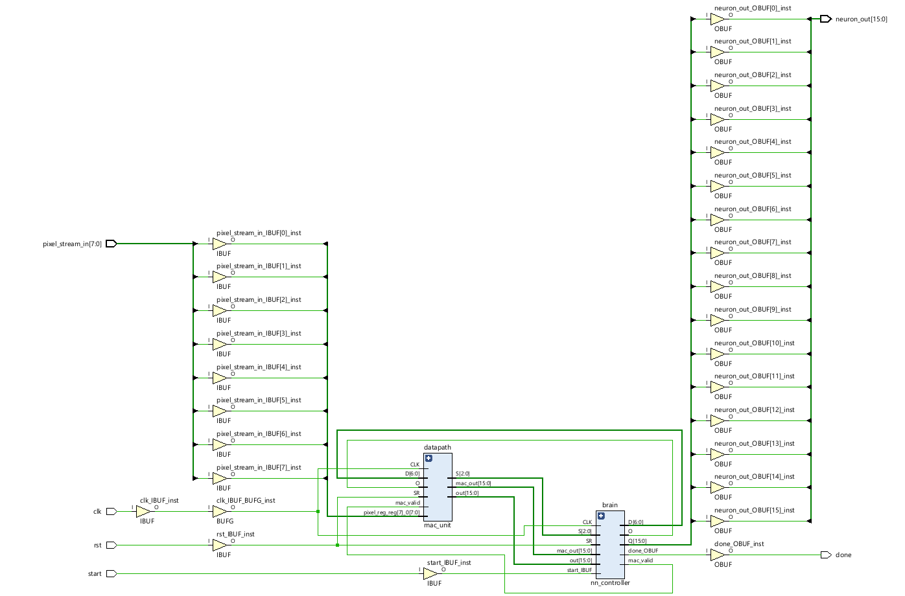
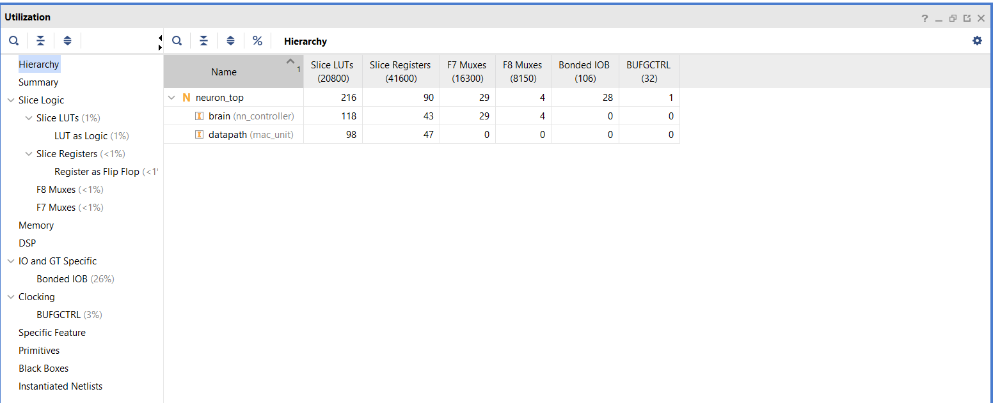

# Quantized Neural Network Hardware Accelerator

## Overview
This project is a custom RTL implementation of a Machine Learning Hardware Accelerator designed for Artix-7 FPGAs. It features a fully pipelined Multiply-Accumulate (MAC) datapath and a Finite State Machine (FSM) controller to automate memory addressing and execute a hardware-level ReLU activation function.

## Architecture
The system bridges high-level AI models with low-level digital logic:
1. **Golden Model (PyTorch):** A baseline Multi-Layer Perceptron (MLP) trained on the MNIST dataset. The floating-point weights are quantized to 8-bit Two's Complement integers (Q7 format) and exported as hexadecimal memory files.
2. **Datapath (`mac_unit.v`):** A 3-stage pipelined MAC unit that performs high-speed signed arithmetic.
3. **FSM Controller (`nn_controller.v`):** The control logic that iterates through 784 image pixels, manages pipeline latency, and applies the ReLU activation algorithm (`max(0, x)`) using logical bit-checks.
4. **Top Module (`neuron_top.v`):** The system wrapper that instantiates the datapath, controller, and infers the quantized weights into Block RAM (BRAM).

## Synthesis & Performance
Synthesized using Xilinx Vivado for the Artix-7 architecture (xc7a35tcpg236-1). The 8-bit quantization strategy successfully forced the synthesizer to map the multiplication logic to standard LUTs rather than consuming dedicated DSP blocks, resulting in an ultra-lightweight footprint.

* **Slice LUTs:** 216 (~1% Utilization)
* **Slice Registers (Flip-Flops):** 90 (< 1% Utilization)
* **DSP Blocks:** 0 (Fully optimized into LUT logic)

## Verification
The design was verified using behavioral simulation in Vivado (`top_tb.v`). The hardware successfully mirrored the mathematical operations of the PyTorch golden model, executing 784 MAC operations and accurately asserting the `done` signal upon completion.

